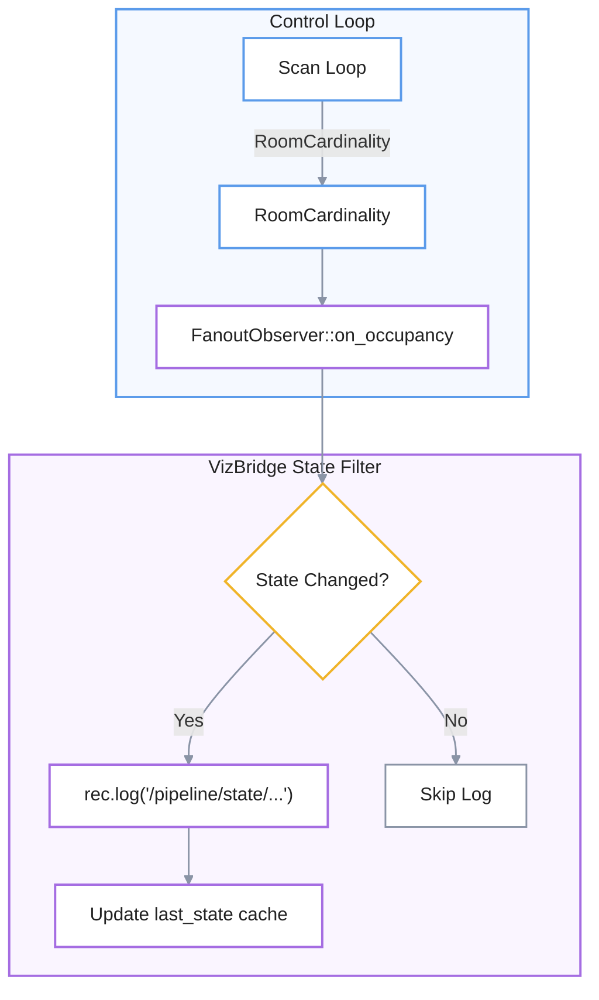
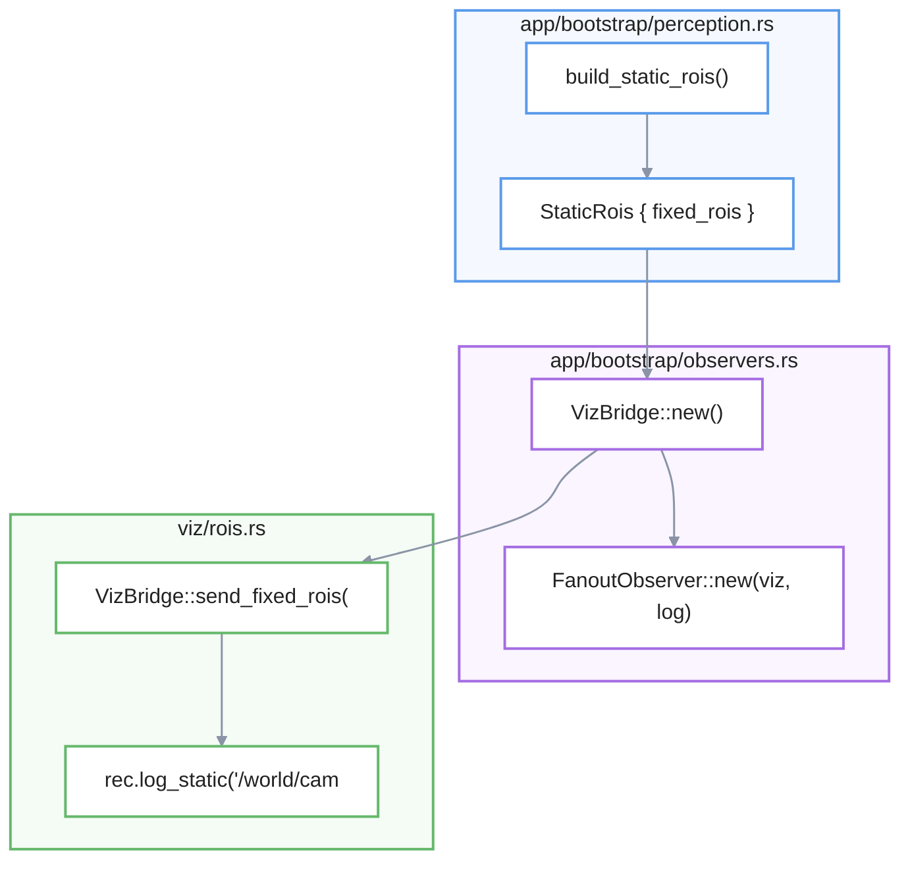

# Pipeline State Visualization
El sistema de **Visualización del Estado del Pipeline** actúa como una ventana en tiempo real hacia el motor de percepción, utilizando el componente **VizBridge** para monitorear la salud y el razonamiento del software. Esta arquitectura optimiza el flujo de datos mediante un **registro de solo cambios**, lo que evita la redundancia al transmitir únicamente las transiciones de estado críticas, como la ocupación de una habitación o la detección de rostros. Además del seguimiento de estados, el sistema organiza jerárquicamente **métricas de rendimiento y regiones de interés (ROI)** tanto estáticas como dinámicas, facilitando el análisis detallado de la latencia y la precisión de la inferencia. Finalmente, el proceso integra una etapa de **traducción de coordenadas y etiquetado**, asegurando que las detecciones visuales se representen correctamente en un espacio global para su inspección técnica.

Relevant source files

- [](https://github.com/kerrvisiona-sudo/endeli/blob/ad24740d/app/bootstrap/observers.rs)
- [](https://github.com/kerrvisiona-sudo/endeli/blob/ad24740d/app/bootstrap/perception.rs)
- [](https://github.com/kerrvisiona-sudo/endeli/blob/ad24740d/app/observer.rs)
- [](https://github.com/kerrvisiona-sudo/endeli/blob/ad24740d/app/record.rs)
- [](https://github.com/kerrvisiona-sudo/endeli/blob/ad24740d/app/tests.rs)
- [](https://github.com/kerrvisiona-sudo/endeli/blob/ad24740d/config/viz.toml)
- [](https://github.com/kerrvisiona-sudo/endeli/blob/ad24740d/viz/rois.rs)
- [](https://github.com/kerrvisiona-sudo/endeli/blob/ad24740d/viz/state.rs)
- [](https://github.com/kerrvisiona-sudo/endeli/blob/ad24740d/viz/tests.rs)

The **Pipeline State Visualization** system provides a real-time, high-fidelity view of the internal decision-making process and health of the `mana-lite` perception engine. It leverages the Rerun integration via `VizBridge` to stream state transitions, inference metrics, and spatial ROIs to a remote or local viewer.

## VizBridge State Tracking

The `VizBridge` maintains a local cache of the last emitted states to implement **change-only logging**. This prevents flooding the Rerun recording stream with redundant data when the system state is stable.

### Key State Fields

The following fields in `VizBridge` track the state of the control system:

- `last_occupancy_state`: Tracks `RoomCardinality` (e.g., `Empty`, `Single`, `Multiple`) [src/viz/state.rs:35-36](https://github.com/kerrvisiona-sudo/endeli/blob/ad24740d/src/viz/state.rs#L35-L36)
- `last_second_person_state`: Tracks `SecondPersonState` (e.g., `None`, `Tentative`, `Confirmed`) [src/viz/state.rs:42-43](https://github.com/kerrvisiona-sudo/endeli/blob/ad24740d/src/viz/state.rs#L42-L43)
- `last_signal_state`: Tracks `SignalValidity` [src/viz/state.rs:49-50](https://github.com/kerrvisiona-sudo/endeli/blob/ad24740d/src/viz/state.rs#L49-L50)
- `last_face_state`: A string-based representation of the current face detection/tracking state [src/viz/state.rs:64](https://github.com/kerrvisiona-sudo/endeli/blob/ad24740d/src/viz/state.rs#L64-L64)

### State Logging Logic

State updates are triggered via the `PipelineObserver` trait. When `on_occupancy` is called, the `FanoutObserver` forwards the data to `VizBridge::log_occupancy_state` [src/app/observer.rs:70-80](https://github.com/kerrvisiona-sudo/endeli/blob/ad24740d/src/app/observer.rs#L70-L80)


```
┌─────────────────────────────────────┐
│ 🔵 Control Loop                     │
│                                     │
│        Scan Loop                    │
│           │                         │
│           ▼                         │
│     RoomCardinality                 │
│           │                         │
│           ▼                         │
│  FanoutObserver::on_occupancy       │
└───────────┬─────────────────────────┘
            │
            ▼
┌─────────────────────────────────────┐
│ 🟣 VizBridge State Filter           │
│                                     │
│          ◇ State Changed?            │
│         ╱              ╲             │
│      Yes                No           │
│       │                  │           │
│       ▼                  ▼           │
│   rec.log(...)        Skip Log       │
│       │                              │
│       ▼                              │
│ Update last_state cache              │
└─────────────────────────────────────┘
```

**Sources:** [src/viz/state.rs:19-65](https://github.com/kerrvisiona-sudo/endeli/blob/ad24740d/src/viz/state.rs#L19-L65) [src/app/observer.rs:70-80](https://github.com/kerrvisiona-sudo/endeli/blob/ad24740d/src/app/observer.rs#L70-L80)

---

## Metric and Performance Logging

`VizBridge` provides several methods to visualize the performance of the ingest and inference stages as scalar plots.

|Function|Entity Path|Description|Toggle|
|---|---|---|---|
|`log_decode_latency`|`/pipeline/decode/latency_us`|Time spent decoding H.264 frames [src/viz/state.rs:67](https://github.com/kerrvisiona-sudo/endeli/blob/ad24740d/src/viz/state.rs#L72-L72)|`decode_latency`|
|`log_infer_latency`|`/pipeline/infer/{model}/latency_us`|Raw backend inference time [src/viz/state.rs:93](https://github.com/kerrvisiona-sudo/endeli/blob/ad24740d/src/viz/state.rs#L93-L93)|`infer_latency`|
|`log_infer_latency`|`/pipeline/infer/{model}/hz`|Frequency derived from `last_infer_at` (under `infer_rate` toggle) [src/viz/state.rs:99](https://github.com/kerrvisiona-sudo/endeli/blob/ad24740d/src/viz/state.rs#L99-L99)|`infer_rate`|
|`log_keyframe_gap`|`/ingest/normal/gap_ms`|Time delta between processed keyframes [src/viz/state.rs:106](https://github.com/kerrvisiona-sudo/endeli/blob/ad24740d/src/viz/state.rs#L109-L109)|`keyframe_gap`|
|`log_keyframe_selection`|`/ingest/keyframes/source_hz`|Incoming keyframe rate from source [src/viz/state.rs:123-124](https://github.com/kerrvisiona-sudo/endeli/blob/ad24740d/src/viz/state.rs#L123-L124)|`keyframe_rate`|

**Sources:** [src/viz/state.rs:67-130](https://github.com/kerrvisiona-sudo/endeli/blob/ad24740d/src/viz/state.rs#L67-L130) [config/viz.toml:13-21](https://github.com/kerrvisiona-sudo/endeli/blob/ad24740d/config/viz.toml#L13-L21)

---

## Rerun Entity Hierarchy

The visualization data is organized into a semantic hierarchy to allow for easy navigation in the Rerun viewer.

### World Space (`/world/camera/*`)

- `/world/camera/rois/fixed/{model}/roi`: Static regions of interest defined in `zones.toml` or `models.toml` (e.g., `face-dwell`) [src/viz/rois.rs:11](https://github.com/kerrvisiona-sudo/endeli/blob/ad24740d/src/viz/rois.rs#L11-L11)
- `/world/camera/rois/{model}/roi/0`: Dynamic ROIs generated by the cascade scheduler for child models [src/viz/rois.rs:52](https://github.com/kerrvisiona-sudo/endeli/blob/ad24740d/src/viz/rois.rs#L50-L50)

### Pipeline Space (`/pipeline/state/*`)

- `/pipeline/state/room/cardinality`: The primary occupancy state [src/viz/state.rs:31](https://github.com/kerrvisiona-sudo/endeli/blob/ad24740d/src/viz/state.rs#L31-L31)
- `/pipeline/state/room/second_person`: Secondary person detection status [src/viz/state.rs:38](https://github.com/kerrvisiona-sudo/endeli/blob/ad24740d/src/viz/state.rs#L38-L38)
- `/pipeline/state/face`: High-level face detection state [src/viz/state.rs:61](https://github.com/kerrvisiona-sudo/endeli/blob/ad24740d/src/viz/state.rs#L61-L61)

**Sources:** [src/viz/rois.rs:8-54](https://github.com/kerrvisiona-sudo/endeli/blob/ad24740d/src/viz/rois.rs#L8-L54) [src/viz/state.rs:19-65](https://github.com/kerrvisiona-sudo/endeli/blob/ad24740d/src/viz/state.rs#L19-L65)

---

## VizBridge Bootstrap

The `VizBridge` is initialized during the perception engine setup in `app/bootstrap/perception.rs` and wired into the observer chain in `app/bootstrap/observers.rs`.

### Perception Engine ROI Setup

During bootstrap, `build_static_rois` extracts ROI rectangles from the `ModelCatalog` and `ZoneCatalog` [src/app/bootstrap/perception.rs:88-144](https://github.com/kerrvisiona-sudo/endeli/blob/ad24740d/src/app/bootstrap/perception.rs#L88-L144) These are passed to the `VizBridge` as `FixedRoi` objects.

### Initialization Flow

1. **Static ROI Extraction**: `build_static_rois` identifies all models with `CropType::Static` [src/app/bootstrap/perception.rs:97-99](https://github.com/kerrvisiona-sudo/endeli/blob/ad24740d/src/app/bootstrap/perception.rs#L97-L99)
2. **Bridge Creation**: `VizBridge::new` is called with the `rerun_addr`, toggles, and fixed ROIs [src/app/bootstrap/observers.rs:89-95](https://github.com/kerrvisiona-sudo/endeli/blob/ad24740d/src/app/bootstrap/observers.rs#L89-L95)
3. **Static Logging**: Upon connection, `VizBridge::send_fixed_rois` uses `rec.log_static` to send ROI boxes once, ensuring they persist in the viewer without per-frame overhead [src/viz/rois.rs:8-24](https://github.com/kerrvisiona-sudo/endeli/blob/ad24740d/src/viz/rois.rs#L8-L24)



```
             app/bootstrap/perception.rs
             ┌──────────────────────────┐
             │ build_static_rois()      │
             │          │               │
             │          ▼               │
             │ StaticRois { fixed_rois }│
             └────────────┬─────────────┘
                          │
                          ▼
             app/bootstrap/observers.rs
             ┌──────────────────────────┐
             │ VizBridge::new()         │
             │       │                  │
             │       ▼                  │
             │ FanoutObserver::new()    │
             └──────┬───────────┬───────┘
                    │           │
                    │           ▼
                    │     FanoutObserver
                    │
                    ▼
                 viz/rois.rs
             ┌──────────────────────────┐
             │ send_fixed_rois()        │
             │       │                  │
             │       ▼                  │
             │ rec.log_static(...)      │
             └──────────────────────────┘
```

**Sources:** [src/app/bootstrap/perception.rs:32-78](https://github.com/kerrvisiona-sudo/endeli/blob/ad24740d/src/app/bootstrap/perception.rs#L32-L78) [src/app/bootstrap/observers.rs:81-99](https://github.com/kerrvisiona-sudo/endeli/blob/ad24740d/src/app/bootstrap/observers.rs#L81-L99) [src/viz/rois.rs:8-24](https://github.com/kerrvisiona-sudo/endeli/blob/ad24740d/src/viz/rois.rs#L8-L24)

---

## Entity Box and Label Generation

Detections are visualized using `log_model_detections` [src/app/record.rs:87](https://github.com/kerrvisiona-sudo/endeli/blob/ad24740d/src/app/record.rs#L87-L87) This function handles:

1. **Coordinate Translation**: If a detection occurred in a crop, it is translated back to the global frame space [src/viz/tests.rs:14-25](https://github.com/kerrvisiona-sudo/endeli/blob/ad24740d/src/viz/tests.rs#L14-L25)
2. **Labeling**: Labels are generated via `detection_label`, which includes the class name, confidence score, and area in pixels [src/viz/tests.rs:6-11](https://github.com/kerrvisiona-sudo/endeli/blob/ad24740d/src/viz/tests.rs#L6-L11)
3. **Entity Pathing**: Detections are logged to `/world/camera/detections/{model}/{class}/{index}`.

**Sources:** [src/app/record.rs:68-107](https://github.com/kerrvisiona-sudo/endeli/blob/ad24740d/src/app/record.rs#L68-L107) [src/viz/tests.rs:6-26](https://github.com/kerrvisiona-sudo/endeli/blob/ad24740d/src/viz/tests.rs#L6-L26)


### On this page

- [Pipeline State Visualization](https://deepwiki.com/kerrvisiona-sudo/endeli/6.2-pipeline-state-visualization#pipeline-state-visualization)
- [VizBridge State Tracking](https://deepwiki.com/kerrvisiona-sudo/endeli/6.2-pipeline-state-visualization#vizbridge-state-tracking)
- [Key State Fields](https://deepwiki.com/kerrvisiona-sudo/endeli/6.2-pipeline-state-visualization#key-state-fields)
- [State Logging Logic](https://deepwiki.com/kerrvisiona-sudo/endeli/6.2-pipeline-state-visualization#state-logging-logic)
- [Metric and Performance Logging](https://deepwiki.com/kerrvisiona-sudo/endeli/6.2-pipeline-state-visualization#metric-and-performance-logging)
- [Rerun Entity Hierarchy](https://deepwiki.com/kerrvisiona-sudo/endeli/6.2-pipeline-state-visualization#rerun-entity-hierarchy)
- [World Space (`/world/camera/*`)](https://deepwiki.com/kerrvisiona-sudo/endeli/6.2-pipeline-state-visualization#world-space-worldcamera)
- [Pipeline Space (`/pipeline/state/*`)](https://deepwiki.com/kerrvisiona-sudo/endeli/6.2-pipeline-state-visualization#pipeline-space-pipelinestate)
- [VizBridge Bootstrap](https://deepwiki.com/kerrvisiona-sudo/endeli/6.2-pipeline-state-visualization#vizbridge-bootstrap)
- [Perception Engine ROI Setup](https://deepwiki.com/kerrvisiona-sudo/endeli/6.2-pipeline-state-visualization#perception-engine-roi-setup)
- [Initialization Flow](https://deepwiki.com/kerrvisiona-sudo/endeli/6.2-pipeline-state-visualization#initialization-flow)
- [Entity Box and Label Generation](https://deepwiki.com/kerrvisiona-sudo/endeli/6.2-pipeline-state-visualization#entity-box-and-label-generation)

