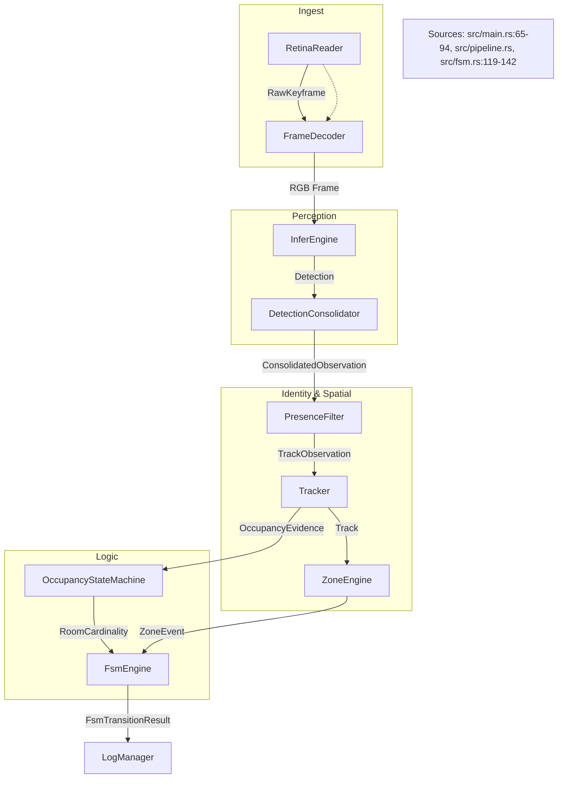

# Glossary

Relevant source files

- 
- 
- 
- 
- 
- 
- 
- 
- 
- 
- 
- 
- 

This page provides definitions for codebase-specific terms, abbreviations, and domain concepts used throughout the `mana-lite` pipeline.

## System Entities and Code Mapping

The following diagram bridges natural language concepts to their specific implementations in the Rust codebase.

### Logic Flow to Code Entity Mapping

**Sources:** [src/main.rs65-94](https://github.com/ernestovisiona-netizen/kik8/blob/43a92847/src/main.rs#L65-L94) [src/fsm.rs49-55](https://github.com/ernestovisiona-netizen/kik8/blob/43a92847/src/fsm.rs#L49-L55) [src/occupancy.rs56-64](https://github.com/ernestovisiona-netizen/kik8/blob/43a92847/src/occupancy.rs#L56-L64) [src/track.rs93-100](https://github.com/ernestovisiona-netizen/kik8/blob/43a92847/src/track.rs#L93-L100) [src/infer.rs95-97](https://github.com/ernestovisiona-netizen/kik8/blob/43a92847/src/infer.rs#L95-L97)

---

## Core Definitions

### Blueprint

A high-level configuration file that defines an end-to-end pipeline profile. It selects specific models, defines cascade rules, and sets tracking requirements.

- **Code Pointer:** `BlueprintConfig` in [src/cascade.rs6](https://github.com/ernestovisiona-netizen/kik8/blob/43a92847/src/cascade.rs#L6-L6) and [src/main.rs133-149](https://github.com/ernestovisiona-netizen/kik8/blob/43a92847/src/main.rs#L133-L149)

### Cascade

A mechanism where the execution of one model depends on the output of another. For example, a high-resolution face detector may only run on a crop generated by a person detector.

- **Code Pointer:** `CascadeScheduler` in [src/cascade.rs122-126](https://github.com/ernestovisiona-netizen/kik8/blob/43a92847/src/cascade.rs#L122-L126) `CascadeRule` in [src/cascade.rs6](https://github.com/ernestovisiona-netizen/kik8/blob/43a92847/src/cascade.rs#L6-L6)
- **Logic:** Rules define requirements like `requires_min_confidence` or `requires_region` [src/cascade.rs105-114](https://github.com/ernestovisiona-netizen/kik8/blob/43a92847/src/cascade.rs#L105-L114)

### CompactMask

A memory-efficient storage format for instance segmentation masks. Instead of storing a full-frame bitmask, it stores a column-major Run-Length Encoded (RLE) mask scoped to the object's bounding box.

- **Code Pointer:** `CompactMask` in [std/mana-geometry/src/compact_mask.rs65-69](https://github.com/ernestovisiona-netizen/kik8/blob/43a92847/std/mana-geometry/src/compact_mask.rs#L65-L69)
- **Implementation:** Uses `vernier-mask` for RLE encoding [std/mana-geometry/src/compact_mask.rs106](https://github.com/ernestovisiona-netizen/kik8/blob/43a92847/std/mana-geometry/src/compact_mask.rs#L106-L106)

### Dwell Timer

A temporal filter used in the FSM to prevent rapid state flickering. A transition only occurs if the guards remain satisfied for a minimum duration.

- **Code Pointer:** `dwell_timers` in [src/fsm.rs53](https://github.com/ernestovisiona-netizen/kik8/blob/43a92847/src/fsm.rs#L53-L53)
- **Logic:** Tracked via `Instant` and compared against `dwell_ms` in configuration [src/fsm.rs81-101](https://github.com/ernestovisiona-netizen/kik8/blob/43a92847/src/fsm.rs#L81-L101)

### FSM (Finite State Machine)

The top-level logic engine that determines the semantic state of the room (e.g., `in_bed`, `exiting`, `searching`).

- **Code Pointer:** `FsmEngine` in [src/fsm.rs49-55](https://github.com/ernestovisiona-netizen/kik8/blob/43a92847/src/fsm.rs#L49-L55)
- **Logic:** Evaluates `FsmGuard` conditions against `FsmSceneContext` [src/fsm.rs119-142](https://github.com/ernestovisiona-netizen/kik8/blob/43a92847/src/fsm.rs#L119-L142)

### Hysteresis

A technique to stabilize state transitions by requiring a delay or a specific number of consistent observations before changing state.

- **Zone Hysteresis:** `hysteresis_ms` in `ZoneState` [src/zones.rs30](https://github.com/ernestovisiona-netizen/kik8/blob/43a92847/src/zones.rs#L30-L30)
- **Occupancy Hysteresis:** Timers for `single_confirm_ms` and `empty_confirm_ms` [src/occupancy.rs195-196](https://github.com/ernestovisiona-netizen/kik8/blob/43a92847/src/occupancy.rs#L195-L196)

### Kalman Filter (Kalman7)

A motion model used by the tracker to predict the future position of a bounding box based on its velocity and aspect ratio changes.

- **Code Pointer:** `Kalman7` in [src/track.rs17](https://github.com/ernestovisiona-netizen/kik8/blob/43a92847/src/track.rs#L17-L17) and [src/kalman.rs](https://github.com/ernestovisiona-netizen/kik8/blob/43a92847/src/kalman.rs)

### Occupancy Cardinality

The high-level classification of how many people are in a room.

- **Variants:** `Empty`, `Single`, `Multiple` [src/occupancy.rs5-9](https://github.com/ernestovisiona-netizen/kik8/blob/43a92847/src/occupancy.rs#L5-L9)
- **Logic:** Managed by `OccupancyStateMachine` [src/occupancy.rs56-64](https://github.com/ernestovisiona-netizen/kik8/blob/43a92847/src/occupancy.rs#L56-L64)

### Presence Filter

A debouncing layer that sits between raw detections and the tracker. It handles short detector dropouts by "holding" a presence signal.

- **Code Pointer:** `PresenceFilter` in [src/presence.rs30-38](https://github.com/ernestovisiona-netizen/kik8/blob/43a92847/src/presence.rs#L30-L38)
- **Logic:** Transitions between `Absent`, `Present`, and `Ambiguous` [src/presence.rs5-9](https://github.com/ernestovisiona-netizen/kik8/blob/43a92847/src/presence.rs#L5-L9)

### ROI (Region of Interest)

A sub-section of a video frame. In `mana-lite`, ROIs are used for static crops (defined in config) or dynamic crops (cascade targets).

- **Code Pointer:** `CropRect` in [src/infer.rs17-22](https://github.com/ernestovisiona-netizen/kik8/blob/43a92847/src/infer.rs#L17-L22)

### Track

A persistent identity assigned to a sequence of detections across multiple frames.

- **Code Pointer:** `Track` in [src/track.rs10-23](https://github.com/ernestovisiona-netizen/kik8/blob/43a92847/src/track.rs#L10-L23)
- **Lifecycle:** Transitions through `Created`, `Updated`, `Lost`, and `Deleted` [src/track.rs26-46](https://github.com/ernestovisiona-netizen/kik8/blob/43a92847/src/track.rs#L26-L46)

### Zone

A named spatial region within the frame (e.g., "bed", "door") used to trigger FSM guards based on track intersection.

- **Code Pointer:** `ZoneEngine` in [src/zones.rs36-38](https://github.com/ernestovisiona-netizen/kik8/blob/43a92847/src/zones.rs#L36-L38)
- **Logic:** Evaluates if a `Track` intersects a `ZoneState` rectangle [src/zones.rs64-73](https://github.com/ernestovisiona-netizen/kik8/blob/43a92847/src/zones.rs#L64-L73)

---

## Data Flow Diagram

The following diagram illustrates how data transforms from raw pixels to semantic state.

### Pipeline Data Transformation

**Sources:** [src/main.rs65-94](https://github.com/ernestovisiona-netizen/kik8/blob/43a92847/src/main.rs#L65-L94) [src/fsm.rs119-142](https://github.com/ernestovisiona-netizen/kik8/blob/43a92847/src/fsm.rs#L119-L142) [src/presence.rs55-59](https://github.com/ernestovisiona-netizen/kik8/blob/43a92847/src/presence.rs#L55-L59) [src/track.rs142-145](https://github.com/ernestovisiona-netizen/kik8/blob/43a92847/src/track.rs#L142-L145) [src/zones.rs64-65](https://github.com/ernestovisiona-netizen/kik8/blob/43a92847/src/zones.rs#L64-L65)

---

## Technical Terms Table

|Term|Implementation Reference|Description|
|---|---|---|
|**Annex-B**|`mana-rtsp` crate|The byte-stream format for H.264 NAL units used during RTSP ingestion.|
|**Hungarian Algorithm**|[src/assignment.rs](https://github.com/ernestovisiona-netizen/kik8/blob/43a92847/src/assignment.rs)|Used by the `Tracker` to solve the linear assignment problem between existing tracks and new detections.|
|**IoU**|`mana-geometry` crate|Intersection over Union. A spatial metric used to match detections to tracks or evaluate zone intersections.|
|**JSONL**|[src/logger.rs](https://github.com/ernestovisiona-netizen/kik8/blob/43a92847/src/logger.rs)|The structured logging format (JSON Lines) used for events and metrics.|
|**NMS**|[src/infer.rs89](https://github.com/ernestovisiona-netizen/kik8/blob/43a92847/src/infer.rs#L89-L89)|Non-Maximum Suppression. A post-processing step to remove redundant overlapping bounding boxes.|
|**POI**|[src/presence.rs33](https://github.com/ernestovisiona-netizen/kik8/blob/43a92847/src/presence.rs#L33-L33)|Person of Interest. The primary entity the pipeline is configured to track.|
|**Rerun**|[src/viz.rs](https://github.com/ernestovisiona-netizen/kik8/blob/43a92847/src/viz.rs)|The external visualization tool used for real-time debugging of the pipeline state.|
|**Static ROI**|[src/infer.rs107](https://github.com/ernestovisiona-netizen/kik8/blob/43a92847/src/infer.rs#L107-L107)|A fixed rectangular crop defined in `models.toml` that the `InferEngine` applies before running a model.|

**Sources:** [src/main.rs48-51](https://github.com/ernestovisiona-netizen/kik8/blob/43a92847/src/main.rs#L48-L51) [src/track.rs3](https://github.com/ernestovisiona-netizen/kik8/blob/43a92847/src/track.rs#L3-L3) [src/infer.rs89-90](https://github.com/ernestovisiona-netizen/kik8/blob/43a92847/src/infer.rs#L89-L90) [src/presence.rs33](https://github.com/ernestovisiona-netizen/kik8/blob/43a92847/src/presence.rs#L33-L33) [src/logger.rs37](https://github.com/ernestovisiona-netizen/kik8/blob/43a92847/src/logger.rs#L37-L37)

### On this page

- [Glossary](https://deepwiki.com/ernestovisiona-netizen/kik8/7-glossary#glossary)
- [System Entities and Code Mapping](https://deepwiki.com/ernestovisiona-netizen/kik8/7-glossary#system-entities-and-code-mapping)
- [Logic Flow to Code Entity Mapping](https://deepwiki.com/ernestovisiona-netizen/kik8/7-glossary#logic-flow-to-code-entity-mapping)
- [Core Definitions](https://deepwiki.com/ernestovisiona-netizen/kik8/7-glossary#core-definitions)
- [Blueprint](https://deepwiki.com/ernestovisiona-netizen/kik8/7-glossary#blueprint)
- [Cascade](https://deepwiki.com/ernestovisiona-netizen/kik8/7-glossary#cascade)
- [CompactMask](https://deepwiki.com/ernestovisiona-netizen/kik8/7-glossary#compactmask)
- [Dwell Timer](https://deepwiki.com/ernestovisiona-netizen/kik8/7-glossary#dwell-timer)
- [FSM (Finite State Machine)](https://deepwiki.com/ernestovisiona-netizen/kik8/7-glossary#fsm-finite-state-machine)
- [Hysteresis](https://deepwiki.com/ernestovisiona-netizen/kik8/7-glossary#hysteresis)
- [Kalman Filter (Kalman7)](https://deepwiki.com/ernestovisiona-netizen/kik8/7-glossary#kalman-filter-kalman7)
- [Occupancy Cardinality](https://deepwiki.com/ernestovisiona-netizen/kik8/7-glossary#occupancy-cardinality)
- [Presence Filter](https://deepwiki.com/ernestovisiona-netizen/kik8/7-glossary#presence-filter)
- [ROI (Region of Interest)](https://deepwiki.com/ernestovisiona-netizen/kik8/7-glossary#roi-region-of-interest)
- [Track](https://deepwiki.com/ernestovisiona-netizen/kik8/7-glossary#track)
- [Zone](https://deepwiki.com/ernestovisiona-netizen/kik8/7-glossary#zone)
- [Data Flow Diagram](https://deepwiki.com/ernestovisiona-netizen/kik8/7-glossary#data-flow-diagram)
- [Pipeline Data Transformation](https://deepwiki.com/ernestovisiona-netizen/kik8/7-glossary#pipeline-data-transformation)
- [Technical Terms Table](https://deepwiki.com/ernestovisiona-netizen/kik8/7-glossary#technical-terms-table)

