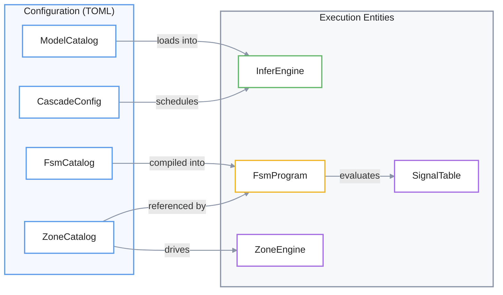

# Glossary
Este glosario técnico describe la arquitectura interna del sistema **endeli**, el cual utiliza visión artificial para gestionar el comportamiento de un entorno a través de una **máquina de estados finitos (FSM)**. El documento detalla cómo la capa de **inferencia y cascada** procesa imágenes mediante modelos de aprendizaje profundo para extraer datos espaciales, que luego se transforman en **señales** y zonas de monitoreo. Estas señales actúan como el puente crítico entre la **percepción** del mundo físico y la **lógica de control**, permitiendo que el motor de ejecución valide reglas y realice transiciones de estado precisas basadas en la presencia o actividad humana. En última instancia, el texto funciona como un mapa de referencia para ingenieros, vinculando **conceptos de lenguaje natural con entidades de código** y estructuras de datos específicas dentro del repositorio.

Relevant source files

- 
- 
- 
- 
- 
- 
- 
- 
- 
- 
- 
- 
- 
- 
- 
- 
- 
- 
- 
- 
- 
- 
- 

This page defines codebase-specific terms, abbreviations, and domain concepts used throughout the **endeli** system. It serves as a reference for onboarding engineers to map natural language concepts to specific code entities and data structures.

## Core Concepts

### 1. Finite State Machine (FSM)

The high-level logic that determines the "state" of a room or scene (e.g., `idle`, `detected`, `in_bed`, `exiting`). It consumes spatial and signal data to drive transitions.

- **FsmCatalog**: The static definition of states and transitions loaded from `fsm.toml` [src/config/mod.rs:24](src/config/mod.rs#L24-L24)
- **FsmProgram**: The compiled and validated runtime representation of an FSM. It resolves all string-based identifiers (states, zones, models) into type-safe IDs [core/mana-control/src/fsm/program.rs129-135](core/mana-control/src/fsm/program.rs#L129-L135)
- **FsmEngine**: The execution engine that evaluates guards and maintains the current state across control cycles [core/mana-control/src/fsm/engine.rs55-61](core/mana-control/src/fsm/engine.rs#L55-L61)
- **FsmGuard**: Logic gates (e.g., `ZoneOccupied`, `DataStale`, `Signal`) that must all return true for a transition to fire [core/mana-control/src/fsm/guard.rs:22-97](core/mana-control/src/fsm/guard.rs#L22-L97)

### 2. Inference & Cascade

The process of running deep learning models on video frames.

- **InferEngine**: Manages the lifecycle of loaded ONNX models and executes prediction [src/infer/mod.rs:47-49](src/infer/mod.rs#L47-L49)
- **Cascade**: A hierarchical execution strategy where a "parent" model (e.g., `person` detector) triggers a "child" model (e.g., `face` detector) on a specific crop of the original frame [src/config/mod.rs:22-23](src/config/mod.rs#L22-L23)
- **CropRect**: A rectangular region in pixel coordinates used to extract a sub-image for child models [core/mana-perception/src/detection.rs10-16](core/mana-perception/src/detection.rs#L10-L16)
- **DetectionConsolidator**: A stateless component that fuses overlapping detections from different models into a single `ConsolidatedObservation` (e.g., attaching a face detection to a person detection) [core/mana-perception/src/detection.rs113-117](core/mana-perception/src/detection.rs#L113-L117)

### 3. Spatial & Signal Domain

The representation of the physical world within the code.

- **Zone**: A named geometric region (AABB) in the frame used for presence monitoring [core/mana-control/src/zones.rs](core/mana-control/src/zones.rs)
- **Signal**: A key-value pair (e.g., `cara.confianza: 0.85`) produced by the perception layer and consumed by the FSM [core/mana-control/src/signals/catalog.rs27-32](core/mana-control/src/signals/catalog.rs#L27-L32)
- **SignalCatalog**: The fixed vocabulary of allowed signals (e.g., `persona.presente`, `ocupacion.cardinalidad`) [core/mana-control/src/signals/catalog.rs60-64](core/mana-control/src/signals/catalog.rs#L60-L64)
- **SignalTable**: A per-cycle container for signal values before they are snapshotted [core/mana-control/src/signals/table.rs29-31](core/mana-control/src/signals/table.rs#L29-L31)

---

## Technical Abbreviations & Signal Tags

|Term|Full Name|Definition|Code Pointer|
|---|---|---|---|
|**AABB**|Axis-Aligned Bounding Box|A rectangle defined by `[x1, y1, x2, y2]` coordinates.|[core/mana-perception/src/detection.rs11](core/mana-perception/src/detection.rs#L11-L11)|
|**IoU**|Intersection over Union|Metric for measuring overlap between two bounding boxes.|[core/mana-perception/src/detection.rs4](core/mana-perception/src/detection.rs#L4-L4)|
|**NMS**|Non-Maximum Suppression|Filtering step to remove redundant overlapping detections.|[src/infer/mod.rs:126](src/infer/mod.rs#L126-L126)|
|**RLE**|Run-Length Encoding|Method used to store segmentation masks efficiently.|[src/logger/serialize/detection.rs:79-85](src/logger/serialize/detection.rs#L79-L85)|
|**FSM State**|`cara.estuvo_dentro`|Signal indicating if a face was previously detected inside the dwell ROI.|[core/mana-control/src/signals/catalog.rs182](core/mana-control/src/signals/catalog.rs#L182-L182)|
|**Cardinality**|`ocupacion.cardinalidad`|Signal representing the room occupancy level (`empty`, `single`, `multiple`).|[core/mana-control/src/signals/catalog.rs174](core/mana-control/src/signals/catalog.rs#L174-L174)|

---

## Data Flow: From Pixels to FSM State

The following diagram bridges the gap between the "Natural Language Space" (Video, Person, State) and the "Code Entity Space" (DecodedFrame, ConsolidatedObservation, FsmEngine).

### System Data Flow
- 🔵 **Configuration** → cosas declarativas provenientes del TOML.
- 🟢 **InferEngine** → runtime/perception.
- 🟡 **FsmProgram** → lógica ejecutable / reglas.
- 🟣 **SignalTable / ZoneEngine** → entidades de ejecución derivadas o

**Sources:** [core/mana-control/src/scan.rs123-154](core/mana-control/src/scan.rs#L123-L154) [src/infer/mod.rs:84-140](src/infer/mod.rs#L84-L140) [core/mana-perception/src/detection.rs132-135](core/mana-perception/src/detection.rs#L132-L135)

---

## Entity Relationships

This diagram maps how configuration objects relate to the runtime execution components.

### Configuration to Execution Mapping

**Sources:** [core/mana-control/src/fsm/program.rs142-144](core/mana-control/src/fsm/program.rs#L142-L144) [src/infer/mod.rs:61-78](src/infer/mod.rs#L61-L78) [core/mana-control/src/signals/table.rs46-51](core/mana-control/src/signals/table.rs#L46-L51)

---

## Signal Catalog Vocabulary (v1)

Signals are the primary interface between the **Perception** layer and the **Control** layer.

|Tag|Kind|Presence Policy|Description|
|---|---|---|---|
|`persona.presente`|`Bool`|`Always`|True if at least one person is confirmed.|
|`persona.cantidad`|`Count`|`Always`|Number of persons detected.|
|`cara.presente`|`Bool`|`Always`|True if a face is detected.|
|`cara.confianza`|`Ratio`|`WhenFaceSelected`|Confidence score of the selected face.|
|`cara.en_dwell`|`Bool`|`WhenDwellRoiConfigured`|True if face is inside the designated ROI.|
|`ocupacion.cardinalidad`|`Label`|`Always`|One of: `empty`, `single`, `multiple`.|

**Sources:** [core/mana-control/src/signals/catalog.rs140-185](core/mana-control/src/signals/catalog.rs#L140-L185)

### On this page

- [Glossary](8-glossary#glossary)
- [Core Concepts](8-glossary#core-concepts)
- [1. Finite State Machine (FSM)](8-glossary#1-finite-state-machine-fsm)
- [2. Inference & Cascade](8-glossary#2-inference-cascade)
- [3. Spatial & Signal Domain](8-glossary#3-spatial-signal-domain)
- [Technical Abbreviations & Signal Tags](8-glossary#technical-abbreviations-signal-tags)
- [Data Flow: From Pixels to FSM State](8-glossary#data-flow-from-pixels-to-fsm-state)
- [System Data Flow](8-glossary#system-data-flow)
- [Entity Relationships](8-glossary#entity-relationships)
- [Configuration to Execution Mapping](8-glossary#configuration-to-execution-mapping)
- [Signal Catalog Vocabulary (v1)](8-glossary#signal-catalog-vocabulary-v1)
