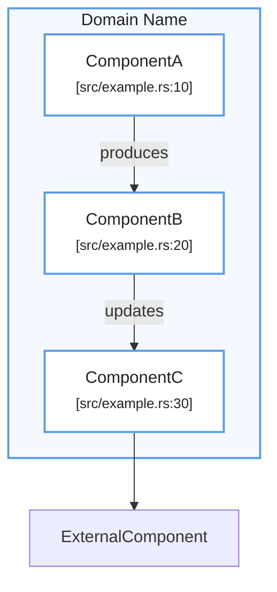

Sí. Y te recomiendo que lo dejemos como un **Design System Mermaid** fijo para que, cuando me pases diagramas en futuras sesiones, pueda aplicar siempre la misma gramática visual.

# Mermaid Architecture Design System

## 1. Filosofía visual

La idea es que los diagramas parezcan parte de **una misma documentación de arquitectura**, no una colección de Mermaid diagrams independientes.

Principios:

- Fondo general neutro.
    
- `subgraph` = **bounded context / módulo / capa**.
    
- Color del `subgraph` identifica el dominio.
    
- Nodos siempre blancos.
    
- El borde del nodo hereda el color del dominio.
    
- Las relaciones son grises/neutras.
    
- Labels de relaciones cortos y semánticos.
    
- Tipografía limpia y discreta.
    
- Referencias de código en segunda línea y menor jerarquía visual.
    
- Evitar colores saturados.
    
- Evitar sombras, gradientes y decoración innecesaria.
    

---

# 2. Paleta principal

|Dominio|Color|Hex|
|---|---|---|
|🔵 Application / Ingest|Azul|`#5B9BEA`|
|🟢 Inference / Tracking|Verde|`#65B86B`|
|🟡 Logic / State|Amarillo|`#F0B429`|
|🟣 Output / Integration|Violeta|`#A56DE2`|
|🔴 Error / Critical|Rojo|`#D95C5C`|
|🟠 External / Infrastructure|Naranja|`#E58A3A`|
|⚪ Neutral / Shared|Gris|`#8A94A6`|

### Fondos de los containers

Usamos versiones **muy suaves**:

```text
Blue     #F5F9FF
Green    #F5FBF5
Yellow   #FFFAF0
Purple   #FAF5FF
Red      #FFF5F5
Orange   #FFF8F0
Gray     #F7F8FA
```

Esto es importante: **el color fuerte está en el borde, no en el fondo**.

---

# 3. Jerarquía de colores

### Nivel 1 — Container

```mermaid
style CONTAINER fill:#F5F9FF,stroke:#5B9BEA,stroke-width:2px,color:#222
```

### Nivel 2 — Node

```mermaid
classDef node fill:#FFFFFF,stroke:#5B9BEA,stroke-width:2px,color:#222
```

### Nivel 3 — Relationship

```text
gris neutro
```

La relación nunca debería competir visualmente con los componentes.

---

# 4. Mapa semántico recomendado

Para nuestro proyecto, usaría esta convención:

### 🔵 Azul — Application / Data Ingest

Para:

- Application
    
- Session
    
- Stream
    
- RTSP
    
- Ingest
    
- Decoder
    
- Readers
    
- Buffers
    
- Transport
    

```text
#5B9BEA
#F5F9FF
```

---

### 🟢 Verde — Perception

Para:

- Inference
    
- Detection
    
- Tracking
    
- Vision
    
- Features
    
- Embeddings
    
- Scene perception
    

```text
#65B86B
#F5FBF5
```

---

### 🟡 Amarillo — Business / Logic / State

Para:

- Rules
    
- Zones
    
- FSM
    
- State machines
    
- Policies
    
- Decisions
    
- Occupancy
    
- Events
    

```text
#F0B429
#FFFAF0
```

---

### 🟣 Violeta — Output / Observability / Integration

Para:

- Output
    
- Visualization
    
- Rerun
    
- Logs
    
- APIs
    
- External integrations
    
- Bridges
    

```text
#A56DE2
#FAF5FF
```

---

### 🟠 Naranja — Infrastructure

Para:

- MQTT
    
- Broker
    
- Database
    
- Storage
    
- GPU
    
- Network
    
- External services
    

```text
#E58A3A
#FFF8F0
```

---

### 🔴 Rojo — Error / Failure

**No usarlo como color de arquitectura normal.**

Reservarlo exclusivamente para:

```text
Error
Failure
Exception
Critical path
Unavailable
Fallback
```

```text
#D95C5C
#FFF5F5
```

---

# 5. Design system de nodos

Todos los nodos normales:

```mermaid
classDef node fill:#FFFFFF,stroke:#8A94A6,stroke-width:1.5px,color:#222
```

Pero cuando pertenecen a un dominio:

```mermaid
classDef applicationNode fill:#FFFFFF,stroke:#5B9BEA,stroke-width:2px,color:#222
classDef perceptionNode fill:#FFFFFF,stroke:#65B86B,stroke-width:2px,color:#222
classDef logicNode fill:#FFFFFF,stroke:#F0B429,stroke-width:2px,color:#222
classDef outputNode fill:#FFFFFF,stroke:#A56DE2,stroke-width:2px,color:#222
classDef infrastructureNode fill:#FFFFFF,stroke:#E58A3A,stroke-width:2px,color:#222
classDef errorNode fill:#FFFFFF,stroke:#D95C5C,stroke-width:2px,color:#222
```

---

# 6. Subgraphs

Siempre:

```mermaid
subgraph INGEST["Ingest Layer"]
    ...
end

style INGEST fill:#F5F9FF,stroke:#5B9BEA,stroke-width:2px,color:#222
```

La regla sería:

> **El color del container y el color de sus componentes deben coincidir.**

Ejemplo:

```text
Ingest Layer
     ↓
azul
```

```text
Inference & Tracking
     ↓
verde
```

```text
Logic & State
     ↓
amarillo
```

```text
Output
     ↓
violeta
```

---

# 7. Relaciones

Las relaciones deben ser **mucho más discretas que los componentes**.

Preferentemente:

```mermaid
A --> B
```

o:

```mermaid
A -->|produces| B
```

Para relaciones secundarias:

```mermaid
A -.->|optional| B
```

Para dependencia:

```mermaid
A -.->|uses| B
```

Para flujo principal:

```mermaid
A -->|produces| B
```

### Semántica

|Relación|Mermaid|
|---|---|
|Flujo de datos|`-->`|
|Dependencia|`-.->`|
|Flujo opcional|`-.->`|
|Produce|`-->|
|Consume|`-->|
|Usa|`-->|
|Actualiza|`-->|
|Reporta|`-->|
|Lee|`-->|
|Escribe|`-->|

---

# 8. Naming convention

También conviene estandarizar esto.

### Componentes

```text
FrameDecoder
IngestEngine
DetectionConsolidator
OccupancyStateMachine
VizBridge
```

**PascalCase** para componentes.

### Funciones

```text
pack_frame_into()
session.play()
session.demuxed()
```

**snake_case** para funciones.

### Archivos

```text
[src/ingest.rs:43]
[src/snapshot.rs:21]
```

Siempre:

```text
[nombre/archivo.ext:línea]
```

y debajo del nombre del componente.

Ejemplo:

```mermaid
FrameDecoder["FrameDecoder<br/><small>[src/snapshot.rs:21]</small>"]
```

---

# 9. Referencias de código

Esta parte me parece especialmente buena para nuestros diagramas.

Siempre:

```text
ComponentName
[src/path/file.rs:123]
```

Visualmente:

```mermaid
A["FrameDecoder<br/><small>[src/snapshot.rs:21]</small>"]
```

La referencia **nunca debe competir con el nombre del componente**.

---

# 10. Layout

### Pipeline

Usar:

```mermaid
flowchart TD
```

Cuando el sistema tiene flujo vertical:

```text
Input
 ↓
Processing
 ↓
Logic
 ↓
Output
```

---

### Arquitectura horizontal

Usar:

```mermaid
flowchart LR
```

Cuando queremos mostrar:

```text
Application → Library → Infrastructure
```

---

### Dentro de un container

Normalmente:

```mermaid
direction TB
```

para pipeline.

Y:

```mermaid
direction LR
```

cuando tenemos componentes hermanos.

---

# 11. Template oficial

Este sería el **template que podemos reutilizar en futuras sesiones**:



---

# 12. Nuestra paleta resumida

Para tenerla a mano en futuras sesiones:

```text
┌──────────────────────┬───────────┬───────────┐
│ Domain               │ Border    │ Background│
├──────────────────────┼───────────┼───────────┤
│ Application / Ingest │ #5B9BEA  │ #F5F9FF   │
│ Inference / Tracking │ #65B86B  │ #F5FBF5   │
│ Logic / State        │ #F0B429  │ #FFFAF0   │
│ Output / Integration │ #A56DE2  │ #FAF5FF   │
│ Infrastructure       │ #E58A3A  │ #FFF8F0   │
│ Error / Critical     │ #D95C5C  │ #FFF5F5   │
│ Neutral              │ #8A94A6  │ #F7F8FA   │
└──────────────────────┴───────────┴───────────┘
```

Y la regla más importante:

> **Color = semántica. No decoración.**

Así, cuando veamos **azul** en cualquiera de los diagramas, ya sabemos que estamos hablando de ingest/application; **verde**, percepción; **amarillo**, lógica/estado; **violeta**, output/integración.

Para las próximas sesiones, si me decís simplemente **“pasemos a Mermaid con nuestro design system”**, puedo aplicar esta convención directamente.